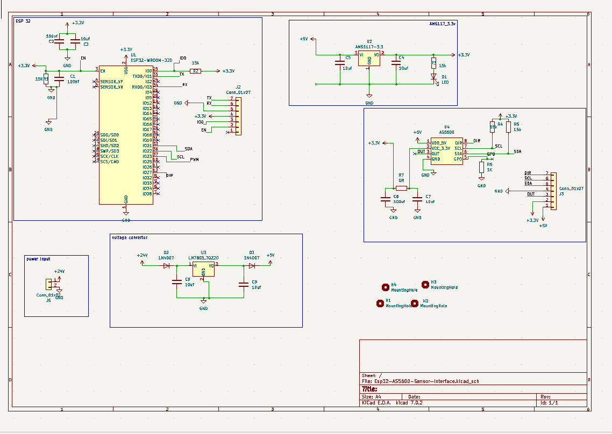
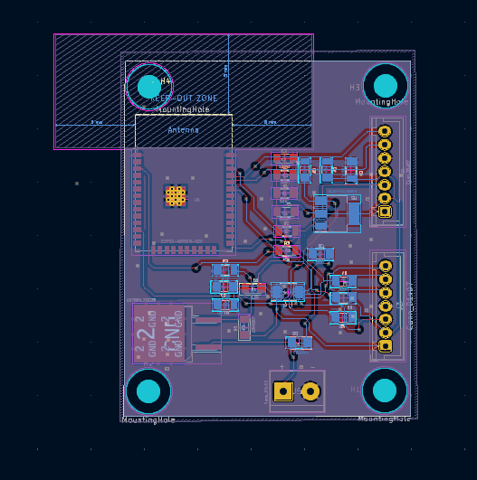
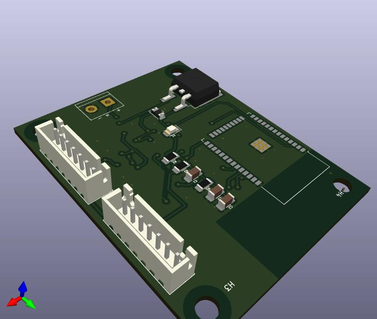

esp32-As5600-sensor schematic
The ESP32 is a powerful, low-cost Wi-Fi and Bluetooth microcontroller designed for IoT applications.it is powerd by a 3.3v supply.The assign as follows:DIR,SCL,SDA,and PWM for the AS5600 function
AMS117use to populor linear voltage regulator and provide the fixed output volatge  from the higher input voltage 
AS5600, a contactless magnetic rotary position sensor, involves careful attention to power supply, communication lines, and layout considerations.
I have use voltage convertor to regulate the power from 24v to 5v.

 
This is interface design of the esp32-as5600-sensor front boad design 
Microcontroller/Esp32 : Position centrally for optimal signal routing and minimize trace lengths.
Power Management: Cluster power components near power input for efficient distribution.
Connectors: Place connectors on edges or corners for easy access and to accommodate external connections.
Peripherals: Arrange peripherals as5600-sensor based on signal flow and proximity to the microcontroller

back board design of the esp32-as5600-sensor 
 Use silkscreen to label components, connectors, and critical signals for easy identification during assembly and troubleshooting.
Component Designators: Clearly mark component designators (R1, C2, IC1, etc.) to aid in assembly and repair.
Design power distribution carefully to ensure stable voltage levels across the board.
 Place decoupling capacitors close to power pins of ICs to filter out noise and stabilize voltage.
 Ensure traces and vias can handle the current requirements without excessive heating.

These are industry-standard files that contain all the necessary information for PCB fabrication. 
Non-conductive ink applied on top of the solder mask for component labels, polarity markings, and other visual indicators. 
The Gerber files dictate the placement and content of silkscreen markings.
They include layers for copper traces, solder mask, silkscreen, drill files, and sometimes assembly data.
The base material (often FR-2 fiberglass) with copper layers laminated together according to the stack-up specified in the Gerber files.
The conductive pathways (traces) and copper pours specified in the Gerber files determine the electrical connectivity and grounding of the PCB.

 Gerber files include drill locations and sizes for vias and mounting holes
 Small holes filled with conductive material to connect copper layers. They enable routing of signals between different layers of the PCB.
After assembly, a surface finish Hot Air Solder Leveling, ENIG - Electroless Nickel Immersion Gold, etc is applied to ensure solderability and protect the PCB

 Manufacturers often perform automated electrical tests to verify connectivity and functionality of the PCB.
IVisual inspection and automated optical inspection (AOI) ensure that the PCB meets design specifications and quality standards.
PCBs are separated from the panel and may undergo additional cutting or routing to remove excess material.

